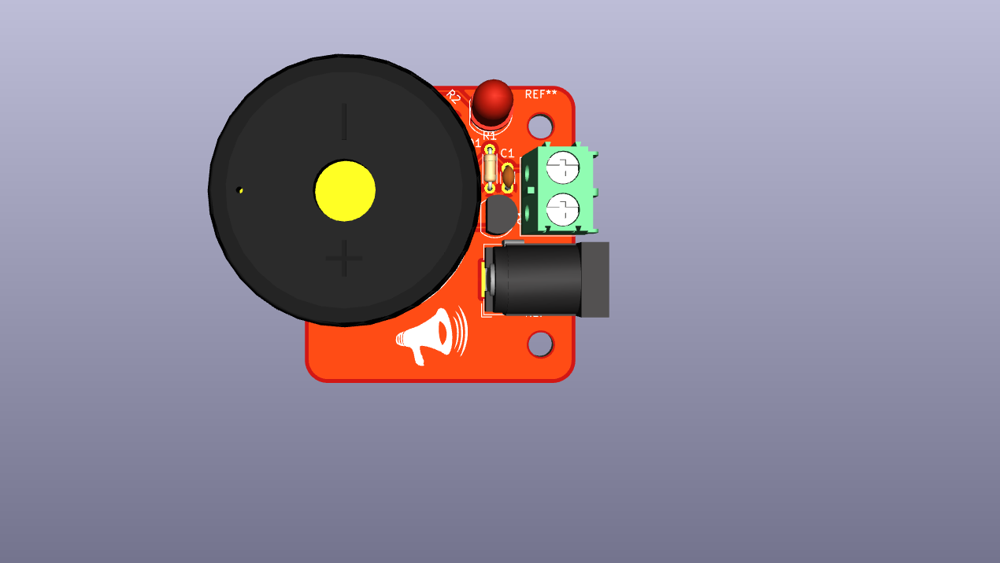
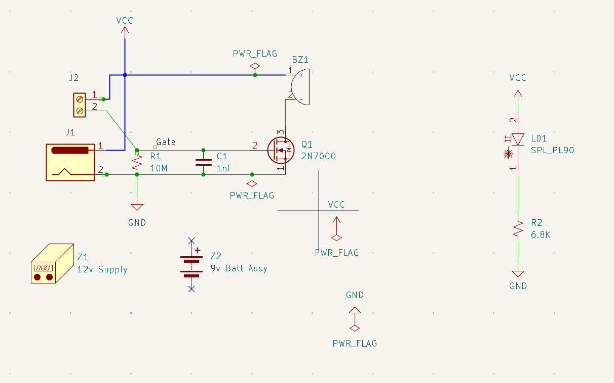
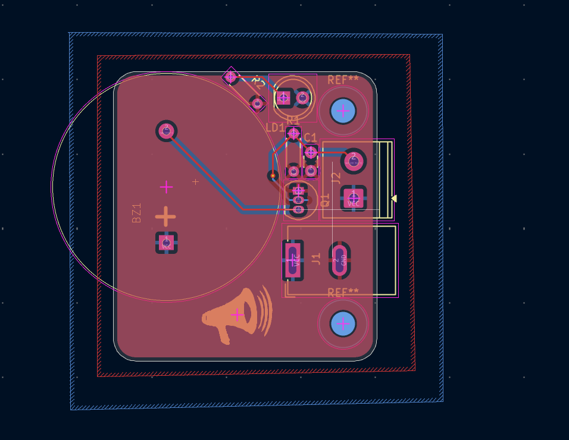

# KiCad Water Alarm
A simple water-detection alarm designed in KiCad, from schematic to PCB layout to 3D render. I built it while following the DigiKey KiCad tutorial series to learn the full design workflow.

## How it works

- Two probes connect to the screw terminal **J2**. One goes to VCC and the other to the gate of **Q1**, a 2N7000 N-channel MOSFET.
- **R1 (10 MΩ)** holds the gate at ground while the probes are dry, so Q1 stays off. **C1 (1 nF)** between gate and ground helps filter noise.
- When water bridges the two probes, a tiny current reaches the gate and turns Q1 on. Q1 then connects the buzzer **BZ1** to ground, and the buzzer sounds.
- **D1** with **R2 (6.8 kΩ)** is an LED that lights whenever the board is powered.
- Power comes in through the barrel jack **J1**. The schematic shows a 12 V supply or a 9 V battery as the power source.

## Parts

| Ref | Part |
|---|---|
| J1 | DC barrel jack (power in) |
| J2 | 2-pin screw terminal (water probes) |
| Q1 | 2N7000 N-channel MOSFET |
| R1 | 10 MΩ resistor |
| C1 | 1 nF capacitor |
| R2 | 6.8 kΩ resistor |
| D1 | LED (power indicator) |
| BZ1 | Buzzer |

## Design files

- `kicad project pcb.kicad_pro`: KiCad project
- `kicad project pcb.kicad_sch`: schematic
- `kicad project pcb.kicad_pcb`: PCB layout
- `buzzer.kicad_sym`: buzzer symbol library

## Schematic

## PCB layout

## Status

Designed in KiCad only. The board has not been built or tested yet.
